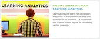

```{r setup, include=FALSE}
# Source code included for the sake of openness
library(flexdashboard)
library(tmap)  
library(ggplot2)
library(gridExtra)
library(sf)

dat <- data.frame(text = c("UvA","Saxion","HU","Zuyd Hogeschool","Windseheim","NHL Stenden hogeschool"), 
                  lat = c(52.367665196,52.2206818,52.0907,50.8812, 52.4995467,53.2112), 
                  long = c(4.88749645,6.8864939,5.1214,5.9592,6.0799891,5.7974))
sites <- sf::st_as_sf(dat, coords = c("long", "lat"), 
                      crs = 4326, 
                      agr = "identity")
```
### Introductie {data-commentary-width=400}

```{r cache=FALSE, message=FALSE, warning=FALSE}
# @TODO add points for institutions involved in survey
data(NLD_muni)
tmap_mode("view")
test<-tm_shape(NLD_muni)+tm_fill()+tm_borders()+
  tm_compass(type = "8star", position = c("left", "top")) + tm_scale_bar(breaks = c(0, 25,50), size = 0.4)
test + tm_shape(sites) + tm_dots( size = 0.5, col="darkblue")
```

***

Welkom op deze site van de SIG Learning Analytics over het gebruik van learning analytics door Nederlandse onderwijsinstellingen. Op deze site geven wij inzicht welke instellingen reeds learning analytics inzetten voor het verbeteren van onderwijs en op welke wijze dit gedaan wordt. De vragenlijst is vanaf eind 2018 beschikbaar en kan nog steeds worden ingevuld – zie de pagina ***Hoe deel tenemen?*** Hoe deel te nemen. Voor meer informatie over learning analytics in Nederland en de SIG Learning Analytics kunt u de [site](https://www.surfspace.nl/sig/18-learning-analytics/) van de SIG bezoeken.


### Samenvatting {data-commentary-width=400}

***Seven*** deelnemende onderwijsinstellingen.

1. Universiteit van Amsterdam, ICTS (Central Services)
2. Universiteit van Amsterdam, FNWI
3. Saxion Hogescholen                             
4. HU   
5. Zuyd Hogeschool                                
6. Windseheim      
7. NHL Stenden hogeschool 

*** 
  
Learning Analytics moet worden gezien in de mondiale context:

Stel je eigen mening over de stand van zaken in. Hier zijn een paar voorbeelden:

1. [The pulse of Learning Analytics](https://www.researchgate.net/publication/228096893_The_Pulse_of_Learning_Analytics_Understandings_and_Expectations_from_the_Stakeholders)
2. [Australian Review](https://www.iru.edu.au/wp-content/uploads/2018/04/MRUN-Learning-Analytics-report.pdf)
3. [Higher Ed leaders in the USA](https://edscoop.com/survey-universities-are-investing-in-data-analytics/)
4. [University of Edinburgh](https://www.ed.ac.uk/information-services/learning-technology/learning-analytics)


### Details {data-commentary-width=400}

```{r}
la0 <- data.frame(
  Type = c("University", "Applied\nSciences"),
  value = c(200/7, 500/7)
  )


la1 <- data.frame(
  Status = c("Other", "Pilot", "Implemented"),
  value = c(100/7, 500/7, 100/7)
  )
lax<-data.frame(
  Scale=c("Single course","Program","Department","whole institution","Other"),
  value = c("")
)


la2 <- data.frame(
  Status = c("No", "Yes", "Planned"),
  value = c(500/7, 100/7, 100/7)
  )

la3 <- data.frame(
  Status = c("bottom-up", "top-down", "both"),
  value = c(500/7, 100/7, 100/7)
  )

p0<-ggplot(la0, aes(x="", y=value, fill=Type))+
geom_bar(width = 1, stat = "identity") + coord_polar("y", start=0)+ggtitle("Type") + xlab("") + ylab("")

p1<-ggplot(la1, aes(x="", y=value, fill=Status))+
geom_bar(width = 1, stat = "identity") + coord_polar("y", start=0)+ggtitle("Maturity") + xlab("") + ylab("")


p2<-ggplot(la2, aes(x="", y=value, fill=Status))+
geom_bar(width = 1, stat = "identity") + coord_polar("y", start=0)+ggtitle("Institutional\nPolicy") + xlab("") + ylab("")

p3<-ggplot(la3, aes(x="", y=value, fill=Status))+
geom_bar(width = 1, stat = "identity") + coord_polar("y", start=0)+ggtitle("Management\nStyle") + xlab("") + ylab("")

grid.arrange(p0,p1,p2,p3,nrow=2,ncol=2)


```

*** 

Zoals te zien in het dashboard is het gebruik van learning analytics binnen Nederlandse onderwijsinstelling nog in een vroeg stadium.


### Hoe deel te nemen? {data-commentary-width=400}

Er zijn verschillende manieren om te participeren met de SIG LA. Hieronder een aantal voorbeelden.

####Show us what you have!

Kennisdeling is een belangrijk aspect bij een multidisciplinair onderwerp zoals learning analytics. De SURF Special Interest Group Learning Analytics (SIG LA) wilt binnen Nederland graag optreden als een learning analytics informatie hub.

Veel (hoger)onderwijsinstellingen passen op een of meerdere niveaus in de organisatie al learning analytics toe. Tijdens het LACE project is op Europees - en zelfs mondiaal niveau een overzicht gemaakt van bewijs wat werkt en wat niet op het gebied van learning analytics. Resultaten hiervan zijn te vinden in de [Evidence Hub](http://evidence.laceproject.eu/). Nationaal is echter geen overzicht van welke instelling wat doet. Wij zijn derhalve gestart met het verzamelen en delen van informatie over het gebruik van learning analytics binnen Nederland.

Gebaseerd op input die deze vragenlijst genereert wordt een Nederlandse learning analytics statusoverzicht gecreëerd. In dit overzicht worden de karakteristieken van learning analytics activiteiten binnen de verschillende onderwijsinstellingen beschreven. Resultaten worden op de SIG’s website gepresenteerd.

Deelname kan via:

*	Learning analytics in Nederland [vragenlijst Nederlands](http://bit.ly/SURFsigLAsurveyNL)
*	Learning analytics in the Netherlands [survey English](http://bit.ly/SURFsigLAsurveyEN)


####Lees of schrijf blogs

Als u iets te vertellen hebt over learning analytics dan kan dat via een blog. Deze wordt dan geplaatst op onze [website](https://www.surfspace.nl/sig/18-learning-analytics/)


####Lees literatuur specifiek voor Nederlandse onderwijsinstellingen

*	Gebruik van [data binnen hoger onderwijs](https://www.surf.nl/binaries/content/assets/surf/nl/kennisbank/2019/whitepaperla_def.pdf)
*	Learning analytics experimenten van [SURFnet](https://www.surf.nl/binaries/content/assets/surf/nl/kennisbank/2018/la-experiment-def.pdf)
*	VU [Code of Practice](https://www.vu.nl/nl/Images/Code-of-practice-privacy-ethiek-SA2017_v1_CC_tcm289-878414.pdf)


####Organiseer een evenement

Eenmaal bekend met learning analytics zou u een workshop of hackaton kunnen organiseren. Overweeg eerst [Hacking the hackaton](https://lakhackathon.files.wordpress.com/2018/02/lakhackathon2018_paper_2.pdf) te lezen.

*	Optimaliseer E-portfolio’s door middel van xAPI en [Entity Extraction of Job Advertisements](https://lakhackathon.files.wordpress.com/2018/02/lakhackathon2018_paper_1.pdf)
*	Welke rol kan learning analytics spelen bij het ondersteunen van studenten bij het opstellen van doelen voor [hun leerpad](https://lakhackathon.files.wordpress.com/2018/02/lakhackathon2018_paper_3.pdf)
*	Integreer privacy in de [architectuur voor learning analytics](https://lakhackathon.files.wordpress.com/2018/02/lakhackathon2018_paper_4.pdf)
*	Multimodal challenge: analytics verder dan [gebruiker-computer interactie](https://lakhackathon.files.wordpress.com/2018/02/lakhackathon2018_paper_5.pdf)
*	Een learning analytics data literacy [speeltuin](https://lakhackathon.files.wordpress.com/2018/02/lakhackathon2018_paper_6.pdf)


#### Kom bij het SIG LA kernteam

Draag bij aan de learning analytics gemeenschap in Nederland en kom bij het kernteam van de SIG. Neem hiervoor contact op met een van de leden van het kernteam.

### Wie zijn wij? {data-commentary-width=400}

#### ORGANISATIE SIG LA



<p>

Een SIG heeft een aantal kenmerken. Ze bestaat uit een kernteam van minimaal 5 mensen uit het Nederlands hoger onderwijs en zijn kernteamleden ieder van een andere onderwijsinstelling. Een kernteamlid neemt de rol van voorzitter op zich. Het kernteam van de SIG Learning Analytics wordt momenteel gevormd door:

* [Justian Knobbout](mailto:justian.knobbout@hu.nl), HU (voorzitter)
* [Maren Scheffel](mailto:maren.scheffel@ou.nl), OU (vice-voorzitter)
* Alan Berg, UvA
* Suzanne Jacobs, TU/e
* Marcel Schmitz, ZUYD
* Albert Vlaardingerbroek, ROC Noorderpoort
 
#### AANDACHTSGEBIEDEN

De SIG heeft voor het jaar 2018 deelgebieden opgesteld:

* Bewijs / Use cases / Best practices
* Visie en beleid (juridisch)
* Onderwijs
* Techniek

De SIG LA zal zowel actief (zelf onderzoek doen) als passief (werk van derden delen) aan deze aandachtsgebieden werken.

#### COMMUNICATIE

Communicatie vanuit de SIG LA vindt plaats via deze Surfspace-pagina. Om geïnformeerd te worden over het laatste nieuws, kunt u lid worden door een profiel aan te maken voor SURFspace en de SIG LA-pagina te volgen. Ook berichten wij via Twitter (**\@SIGLA_NL**). Door dit account te volgen bent u altijd op de hoogte van recente ontwikkelingen rondom de SIG.